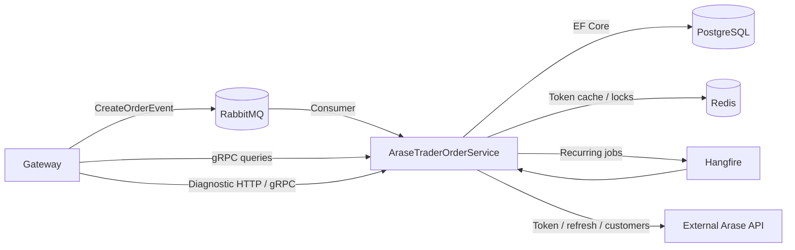
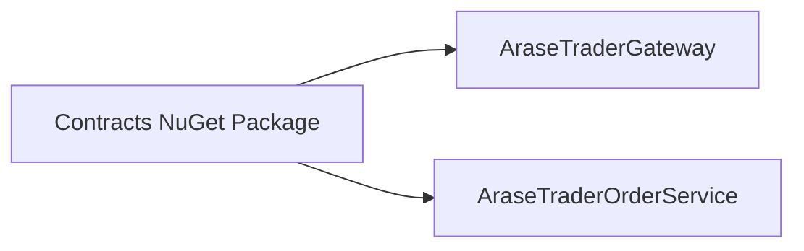
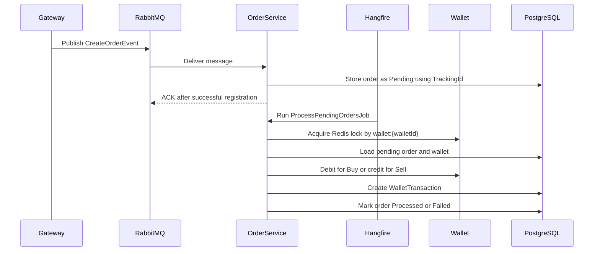

# AraseTraderOrderService

## Overview

AraseTraderOrderService is the order and wallet service in the AraseTrader distributed system. It owns order registration, wallet balance processing, customer synchronization, and query APIs used by other services such as Gateway.

The service is responsible for:

- Synchronizing customers from the external Arase API.
- Managing customer wallets and wallet transaction history.
- Registering incoming buy and sell orders.
- Processing pending orders against customer wallets.
- Exposing gRPC query services for wallet and order reads.

## Architecture

The service follows a Clean Architecture style with separate Domain, Application, Infrastructure, Contracts, and Api projects. HTTP, RabbitMQ, Hangfire, and gRPC act as delivery mechanisms that call application use cases. Persistence, messaging, caching, and external API integrations are isolated in Infrastructure.



## Shared Contracts Package

The Contracts project contains the shared integration surface for the distributed system:

- gRPC service contracts.
- gRPC request and response models.
- Shared integration contracts such as `CreateOrderEvent`.

Contracts should be published as a private NuGet package. AraseTraderGateway should consume that package instead of referencing OrderService projects directly.



This approach supports:

- **Contract-first integration**: Services agree on explicit contracts instead of implementation details.
- **Independent deployment**: Gateway and OrderService can be built and deployed separately.
- **Reduced coupling**: Consumers do not reference Application, Infrastructure, Domain, or Api projects.
- **Versioned contracts**: Contract changes can be released and adopted intentionally through NuGet versions.

## Main Responsibilities

- **Customer Synchronization**: Imports customers from the external Arase API, upserts them by national code, and creates missing wallets with zero balance.
- **Order Registration**: Accepts gateway-generated order tracking identifiers and stores orders as pending for later wallet processing.
- **Order Processing**: Processes pending orders in batches, debits or credits wallets, and writes immutable wallet transaction records.
- **Wallet Management**: Provides wallet balance and transaction history queries through diagnostic HTTP endpoints and gRPC.
- **Integration Boundaries**: Consumes RabbitMQ messages, exposes code-first gRPC services, and uses resilient HTTP clients for external API calls.

## Order Processing Flow



## Reliability and Consistency

- **TrackingId idempotency**: Order registration is idempotent by `TrackingId`. If a RabbitMQ message is redelivered or Gateway retries the same order, the service returns the existing order instead of creating a duplicate.
- **RabbitMQ acknowledgements**: The RabbitMQ consumer uses manual acknowledgements. Messages are acknowledged only after the application use case succeeds. Failed messages are negatively acknowledged without requeue so they can be routed to a dead-letter queue.
- **Redis distributed lock**: Wallet processing uses a Redis-backed distributed lock with resource keys such as `wallet:{walletId}`. This prevents concurrent workers from modifying the same wallet balance at the same time.
- **Hangfire retries**: Background jobs are hosted through Hangfire, allowing recurring execution and retry behavior for operational resilience.
- **Immutable WalletTransaction**: Wallet transactions represent ledger entries. They do not have `UpdatedAt`, preserving an immutable financial audit trail.

## External API Integration

The service integrates with the external Arase API for customer synchronization:

- `POST /api/auth/token`: obtains the initial access token using configured credentials.
- `POST /api/auth/refresh`: refreshes the cached access token using the previous access token.
- `GET /api/customers`: retrieves customers for synchronization.

Access tokens are cached in Redis to avoid unnecessary authentication calls. If a cached token exists, the service attempts refresh before calling the customer endpoint. If refresh fails, it removes the cached token and requests a new one.

External API clients are registered with `HttpClientFactory` and use a simple Polly retry policy for transient failures:

- HTTP `408`
- HTTP `429`
- HTTP `5xx`
- `HttpRequestException`

For HTTP `429`, the retry policy respects the `Retry-After` header when present. Otherwise, it uses exponential backoff with delays of 2, 4, and 8 seconds.

## gRPC Services

The service exposes code-first gRPC contracts through the Contracts project.

- **Wallet gRPC service**: Provides wallet lookup by customer id and wallet transaction history by wallet id.
- **Order gRPC service**: Provides order lookup by tracking id.
- **Code-first gRPC**: Uses protobuf-net.Grpc contracts instead of `.proto` files, keeping shared contracts dependency-light for other services such as Gateway.

The Api project implements the gRPC transport boundary and delegates business operations to application services.

## Configuration

The service is configured through `appsettings.json`, environment variables, user secrets, or docker-compose overrides.

- **ConnectionStrings**: Contains `DefaultConnection`, the PostgreSQL connection used by EF Core and Hangfire storage.
- **RabbitMq**: Defines connection settings and topology for the `CreateOrderEvent` consumer, including exchange, queue, routing key, dead-letter exchange, and dead-letter queue.
- **Redis**: Provides the Redis connection string used for distributed token cache and distributed wallet locks.
- **AraseExternalApi**: Contains the external API base URL and credentials used for token, refresh, and customer synchronization calls.
- **Hangfire**: Defines dashboard path, recurring job cron expressions, timezone, and wallet lock expiry.

Secrets such as external API credentials should be supplied from environment variables, user secrets, or deployment configuration rather than committed to source control.

## Running Locally

Local development requires the infrastructure dependencies used by the service:

- PostgreSQL for application persistence and Hangfire storage.
- Redis for token caching and wallet distributed locks.
- RabbitMQ for `CreateOrderEvent` message consumption.

Typical local workflow:

```bash
dotnet restore AraseTraderOrderService.sln
dotnet ef database update --project Infrastructure --startup-project Api
dotnet run --project Api
```

Before running the API, ensure `DefaultConnection`, Redis, RabbitMQ, and `AraseExternalApi` settings point to local or development resources.

## Docker

Build the service image from the solution root:

```bash
docker build -t arasetrader-order-service .
```

Run the API container on port `8080`:

```bash
docker run --rm -p 8080:8080 \
  -e ASPNETCORE_ENVIRONMENT=Development \
  -e ConnectionStrings__DefaultConnection="Host=host.docker.internal;Port=5432;Database=arasetrader_order;Username=postgres;Password=postgres" \
  -e Redis__ConnectionString="host.docker.internal:6379" \
  -e RabbitMq__HostName="host.docker.internal" \
  arasetrader-order-service
```

In a full local environment, docker-compose should provide PostgreSQL, Redis, RabbitMQ, and the OrderService container on the same network.

## Design Decisions

- **Pending orders**: Orders are stored as `Pending` first so registration remains fast and wallet processing can happen asynchronously, retryably, and in batches.
- **RabbitMQ**: RabbitMQ decouples Gateway from OrderService and supports Event-Driven Architecture for order creation.
- **gRPC**: gRPC provides a strongly typed, efficient synchronous query boundary for Gateway and other internal services.
- **Redis distributed lock**: Redis locks protect wallet balance updates when multiple workers or job executions try to process orders for the same wallet.
- **Immutable WalletTransaction**: Wallet transactions form a financial ledger. Keeping them immutable preserves auditability and prevents historical balance changes from being overwritten.

## Related Repository

**AraseTraderGateway** is the entry point for external clients. It is responsible for receiving client requests, generating order `TrackingId` values, publishing `CreateOrderEvent` messages to RabbitMQ, and querying OrderService through the shared Contracts package and gRPC services.

## Technologies

- **.NET 8**: Runtime and application framework.
- **PostgreSQL**: Relational persistence for customers, wallets, orders, and wallet transactions.
- **RabbitMQ**: Event-driven order registration via `CreateOrderEvent`.
- **Redis**: Distributed token cache and distributed wallet locks.
- **Hangfire**: Recurring background jobs for customer synchronization and pending order processing.
- **gRPC**: Synchronous cross-service query APIs.
- **Polly**: Retry policy for transient external API failures.
- **Docker**: Containerized build and runtime support.
- **FluentValidation**: Request validation for API inputs.
- **Mapster**: Lightweight mapping between ViewModels, DTOs, contracts, and entities.
